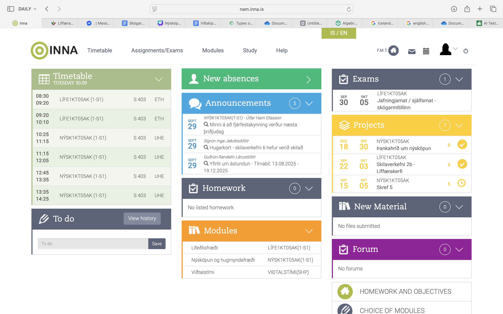

þetta repo inniheldur markdown

# stærsta fyrirsögnin
## Næststærsta fyrirsögnin
### minni fyrirsögn
#### aðeins minni fyrirsögn
##### enn minni
###### minnsta

_skáletrun_, **feitletrun**, _**skáletrun og feitletrun**_

---

Listi af 
einhhverju

* liður 1
  * undirliður 1
  * undirliður 2
    * undirundirliður 1
    * undirundirliður 2
* liður 2
* liðdur 3

---

##3 Númeraður listi
1. Aðal liðurinn
   1. Númeraður undirliður 1
   2. Númeraður undirliður 2
1. Liður 1
   * Ónúmeraður undirliður 2
1. Liður 2
1. Liður 3

---

### Myndir og hlekkir

https://www.tskoli.is

![Plaggat fyrir ától](https://tskoli.is/wp-content/uploads/2026/01/619784716_18550356451009010_8833108873031260878_n.jpg

---

Dálkur 1 | Dálkur 2 | Dálkur 3
--: | :-:| ---
10 | 20 | 40
**50** | 20 | 60
90 | 10 | 20
